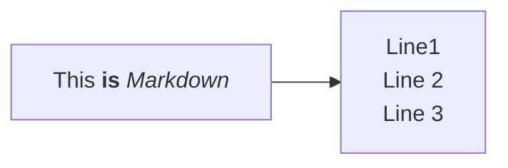

# Contribution Guide

Your contribution to the e!DAL-PGP Knowledge Base is highly appreciated. This guide is intended to show you how to contribute new articles and tutorials or review and adapt parts of existing ones. For changes and suggestions, feel free to open a GitHub issue or pull request.

- [Setup](#setup)
  - [Installation](#installation)
  - [Create content and watch locally](#create-content-and-watch-locally)
  - [Check for dead links](#check-for-dead-links)
  - [Markdown](#markdown)
  - [VSCode](#vscode)
- [Authorship](#authorship)
- [Style Guide](#style-guide)
- [Composition](#composition)
  - [Use Starlight components](#use-starlight-components)
  - [Use Custom components](#use-custom-components)
  - [Images](#images)
  - [html](#html)

## Setup

The e!DAL-PGP Knowledge Base is built on [astro starlight](https://starlight.astro.build). 
Additional custom components and styling were reused from https://github.com/nfdi4plants/nfdi4plants.knowledgebase create by [Kevin Freymaurer](https://github.com/Freymaurer). Many features not covered here specifically may be found in their docs.

Starlight itself builds on [Astro](https://astro.build). Please check out [their website](https://docs.astro.build/en/install-and-setup/) for detailed installation instructions.

### Installation

1. Install [Node JS](https://nodejs.org/)
2. Clone the Knowledge Base repository via `git clone https://github.com/IPK-BIT/edal-pgp-knowledgebase`

### Create content and watch locally

1. Install package dependencies via `npm install`
2. Start the knowledge base in watch mode via `npm run dev`

### Check for dead links

Especially when moving or cross-linking files (other articles or images), make sure to test-build the site via `npm run build`! This validates all links.

### Markdown

All articles are written in markdown (.md or .mdx).
See https://starlight.astro.build/guides/authoring-content/ for a short introduction.

### VSCode

We recommend working with VSCode to generate content.

Recommended VSCode extensions:

- Astro Build: https://marketplace.visualstudio.com/items?itemName=astro-build.astro-vscode
- MDX: https://marketplace.visualstudio.com/items?itemName=unifiedjs.vscode-mdx

💡 The mdx files cannot be previewed in VSCode. Please use `npm run dev` as described above.

## Authorship

Authors listed via a file in [`src/content/authors`](src/content/authors) can easily be mentioned in the yaml header of articles. 

For example `src/content/authors/kevin-frey.yml`:

```yaml
name: Kevin Frey
image: "@images/authors/kevin-frey.jpg"
socials:
  - icon: simple-icons:github
    href: https://github.com/Freymaurer
  - icon: simple-icons:orcid
    href: https://orcid.org/0000-0002-8510-6810
affiliation: DataPLANT
styling:
  text: KFR
```

The author is linked simply via yaml article metadata

```yaml
authors:
  - kevin-frey
```

## Style Guide


All files and folders must always be [kebap-case](https://developer.mozilla.org/en-US/docs/Glossary/Kebab_case). This means all lower case and `-` as word separator.

```txt title="Example"
src\assets\images\arc-commander\access-2.png
```


## Composition

Always follow **DRY (Don't Repeat Yourself)** principle. If you have the same content in multiple places, consider creating a reusable component.

In `.mdx` you can not only link to other content, but also directly insert other content in the current file.


### Use Starlight components

The Starlight framework has some nice components that can be used in the `.mdx` files.

Have an eye on the existing components to improve the readability of the content.

[Starlight components](https://starlight.astro.build/components/using-components/)

### Use Custom components

Checkout the `src/components/mdx` directory for custom components.

Can only be used in mdx files.

#### Mermaid

```mdx
import Mermaid from '@components/mdx/Mermaid.astro'

<Mermaid>

</Mermaid>
```

#### Viola Says

```mdx
import ViolaSays from '@components/ViolaSays.astro'

<ViolaSays>
Ok, I think I understand. The study is used to describe the overall experiment and the sample generation. Then the assays are used to describe the individual lab processes and the data generation!
</ViolaSays>
```

#### File Trees

Example file trees can be generated with the FileTree component, e.g.

```mdx
import { FileTree } from '@astrojs/starlight/components'

<FileTree>
- assays
    - **SugarMeasurement**
        - dataset
            - ...
        - protocols
            - ...
        - isa.assay.xlsx
        - README.md
    - ...
</FileTree>
```


### Images

#### How to store

Try to use `.svg` files for icons, graphics and logos. Use any other file format for screenshots or tutorial images.

Images should be stored in the `src/assets/images` directory. If your image has a obvious context, you SHOULD create a subdirectory for it. 

```txt title="Example"
src
|-- assets
    |-- images
        |-- arc-commander
            |-- access-1.png
            |-- access-2.png
            |-- access-3.png
```

#### Use in `.md`/`.mdx`

Two options to insert images.

In markdown you can use the following syntax:

```md

```

For html in `.mdx` you can use the following syntax:

```mdx
import MacOSSecurity from "@images/arcitect/macos-security.png"


```

### html

Try to avoid html as it will usually override the consistent page design.  
**Don't use `<br />`!**

If you really need some special design or styling, raise an issue or contact the main contributors to discuss.
