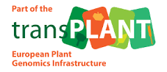

The development of the e!DAL API is funded and supported by several projects:

  
  

  [DPPN](http://www.dppn.de/dppn/EN/Home/home_node.html) – The German Federal Ministry of Education and Research within the German-Plant-Phenotyping Network "DPPN" (FKZ 031A053)
  

  
  

  [transPLANT](http://www.transplantdb.eu/) – The European Commission in the transPlant project within its 7th Framework Program, under the thematic area “Infrastructures”, contract number 283496
  

  
  

  [de.NBI](https://www.denbi.de/) – The PGP repository as first instance of the e!DAL API is registered as a service of the German Network for Bioinformatics Infrastructure (de.NBI).
  

  
  
  
  

  [ELIXIR Germany](https://www.elixir-europe.org/about-us/who-we-are/nodes/germany) – 
  

  
  

  [IPK Gatersleben](http://www.ipk-gatersleben.de/) – e!DAL was initiated and developed at Leibniz Institute of Plant Genetics and Crop Plant Research (IPK) Gatersleben as infrastructural service.
  

