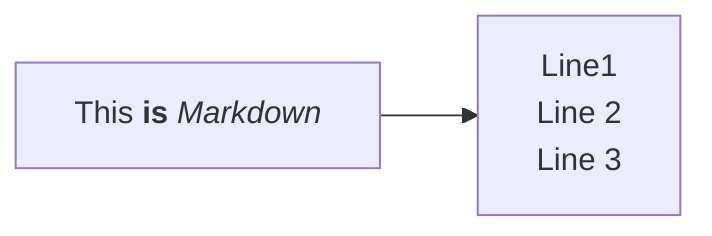

### Viola Chat Bubble

import ViolaSays from '@components/ViolaSays.astro'

<ViolaSays>
This is a chat bubble with viola
</ViolaSays>

### Mermaid support

import Mermaid from '@components/mdx/Mermaid.astro'

<Mermaid>

</Mermaid>


## Authorship

Authors listed via a file in [`src/content/authors`](src/content/authors) can easily be mentioned in the yaml header of articles. 

For example `src/content/authors/kevin-frey.yml`:

```yaml
name: Kevin Frey
image: "@images/authors/kevin-frey.jpg"
socials:
  - icon: simple-icons:github
    href: https://github.com/Freymaurer
  - icon: simple-icons:orcid
    href: https://orcid.org/0000-0002-8510-6810
affiliation: DataPLANT
styling:
  text: KFR
```

The author is linked simply via yaml article metadata

```yaml
authors:
  - kevin-frey
```

